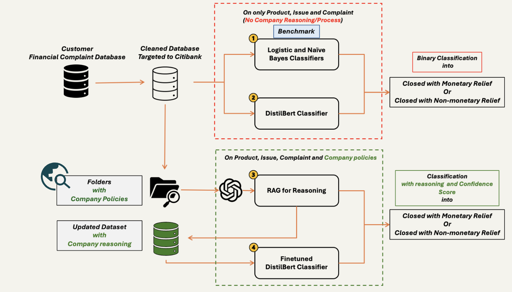
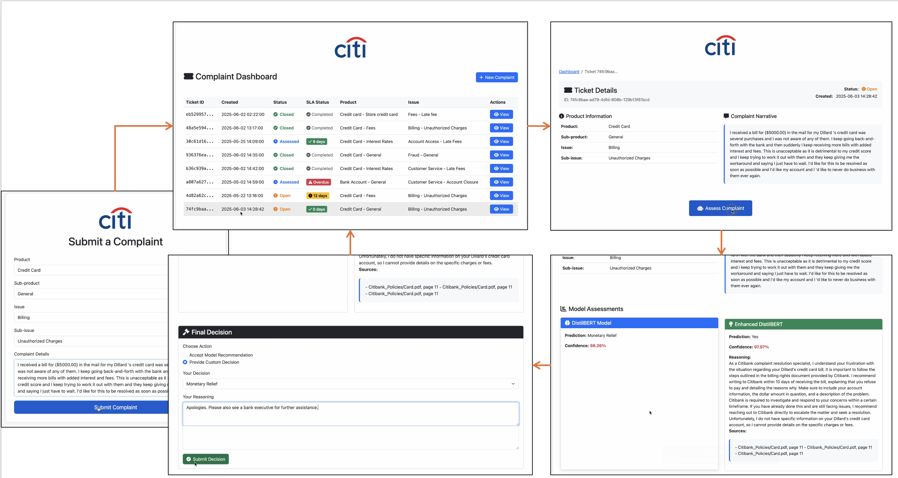

# Decision Support System for Citibank Consumer Financial Complaints

This project implements a business-aligned Decision Support System (DSS) designed to triage financial complaints submitted by Citibank customers. The system integrates traditional ML classifiers, transformer-based LLMs (DistilBERT), and a Retrieval-Augmented Generation (RAG) pipeline to deliver interpretable, high-impact decision support.

---

## System Architecture



---

## Web Application (Flask Dashboard)

A working prototype of the complaint handling workflow, built using Flask.



---

## Installation

```bash
git clone https://github.com/smritikotiyal/IMT526_Finals.git
cd IMT526_Finals
pip install -r requirements.txt
```

---

## Setup Instructions

1. **Train the base DistilBERT model:**
```bash
python distilbert_classifier.py
```

2. **Train the RAG-enhanced DistilBERT model:**
```bash
python enhanced_distilbert_classifier.py
```

- Training data for RAG-enhanced DistilBERT is included in `df_citi_with_rag_reasoning.csv`.
- This CSV is generated using:
  - `rag_classifier.py`
  - `update_complaints_with_rag.py`

3. **Set your OpenAI API Key:**
```bash
export OPENAI_API_KEY=your-key-here
```
Or set it directly in code.

---

---

## Baseline Models

Watch a full walkthrough here:  
```run Baseline_Model.ipynb on JN
```
---

## Run the Web Dashboard

```bash
python app.py
```

---

## Prototype Demo

Watch a full walkthrough here:  
[Demo Video](https://drive.google.com/file/d/1dghxD70kV-yVTl_sgUJbK2vEcRqZCuIh/view?usp=drive_link)

---

## Contributors

- Anne Huen Wai Wong  
- Aug Wu  
- Chung-Wei Chuang  
- Joy Tang  
- Mahammad Rafi Shaik  
- Smriti Kotiyal
